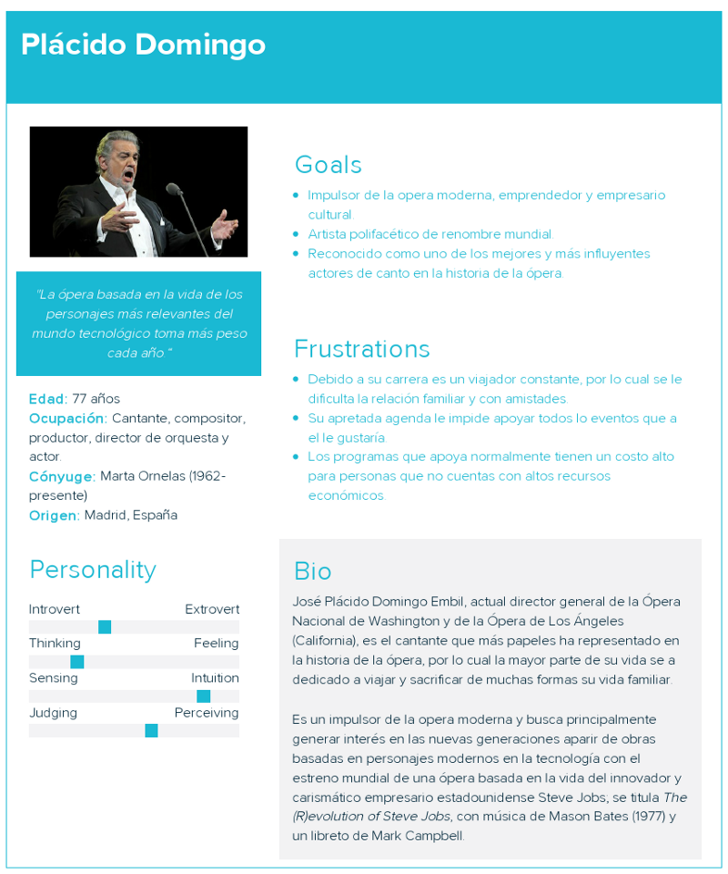

# User Persona

Ejercicio UX desarrollo de User Persona con un cantante de opera

## Concepto

Las User Personas representan personas reales, que viven y respiran y que serian futuros clientes potenciales de nuestro producto, técnicamente las user personas son hipotéticos, sin embargo la información que mostremos de ellos  _no_  debe _ser hipotética._ Todas las secciones deben completarse en base a hechos, datos duros e investigación.

Una vez defina la user persona en mi mente mis dudas son muchisimas y entre ellas se encuentran: “¿Que información es relevante de estas personas? ¿En que formato debo presentar esta información? ¿Cómo puedo conectar con personajes ideales de comprador? ¿Cuantas user personas debo tener? y sobre todo ¿Como se que mi user persona es correcta?”

Para estas dudas un articulo que resolvio muchas de mis dudas fue:  [inboundemotion.com](https://www.inboundemotion.com/blog/que-es-un-user-persona-en-inbound-marketing)

En este articulo encontré que para desarrollar un perfil de  **user persona**  un buen paso es hacer una lista con una serie de preguntas de los prospectos clientes y hacer preguntas acerca del proceso de compra/venta que el público objetivo está buscando, para después hacer una serie de investigaciones y recopilar esta información.

Un dato importante es que seguramente, encontraremos más de un perfil a desarrollar para poder segmentar a nuestro público potencial y deberemos ofrecer contenido diferente para cada uno de estos users persona en función de sus necesidades y el estudio de compra en el que se encuentren.

### Mi ejemplo de user persona

